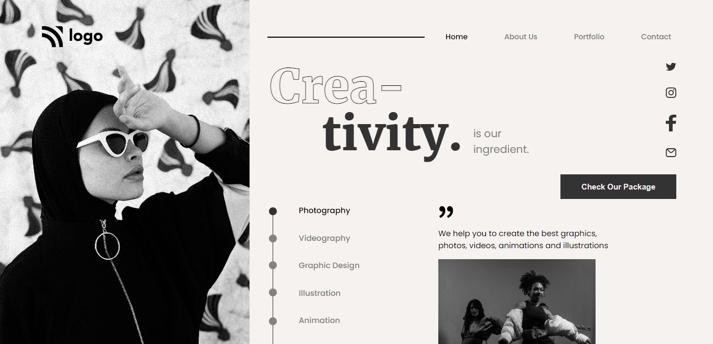

## ⭐Project 14- Dance Home Page⭐

 

## 📌 Live Site URL: <a href="https://14dance-page.netlify.app/">**Visit Now**</a>

 

## 📌 Screenshot:

 

## 📌 What I Learned:

- ### Learned about overflow property
- ### Learned in-depth about Flexbox properties
- ### Learned about webkit-text-stroke-width/color
- ### In this project layout of the page was challenging for me achieved this layout through flexbox

 

## 📌 Time Taken To Complete This Project:

- ### It took me 5 hours to complete this project

 

## 📌 Social Links:

